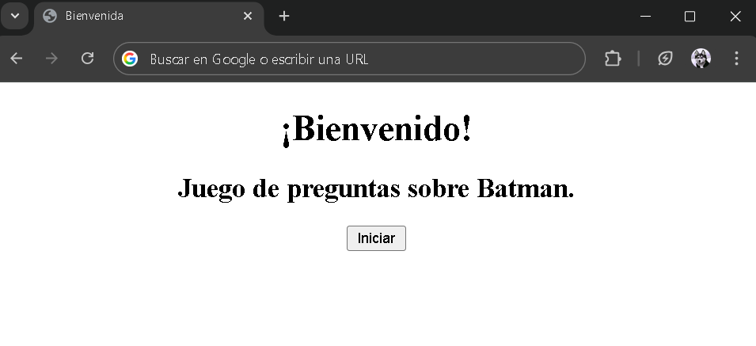
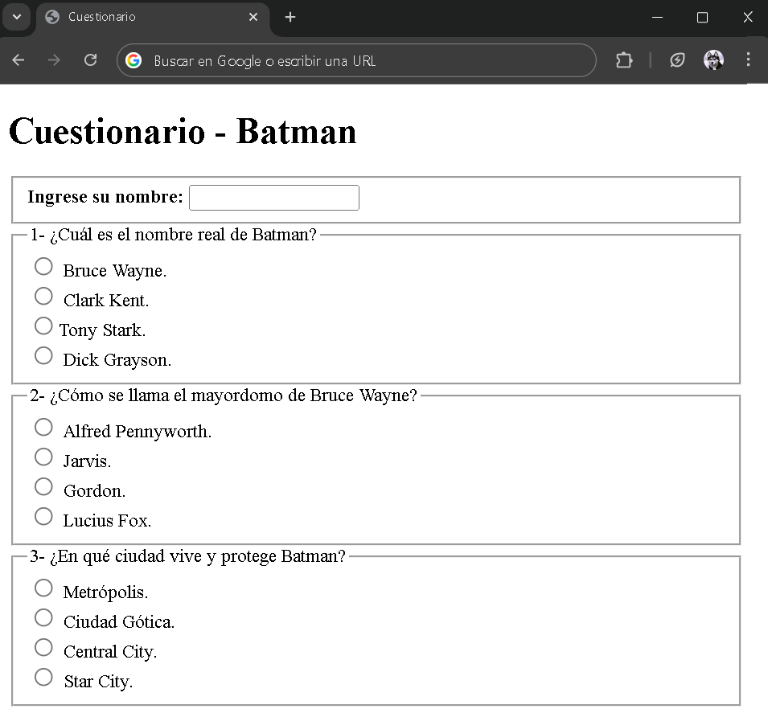
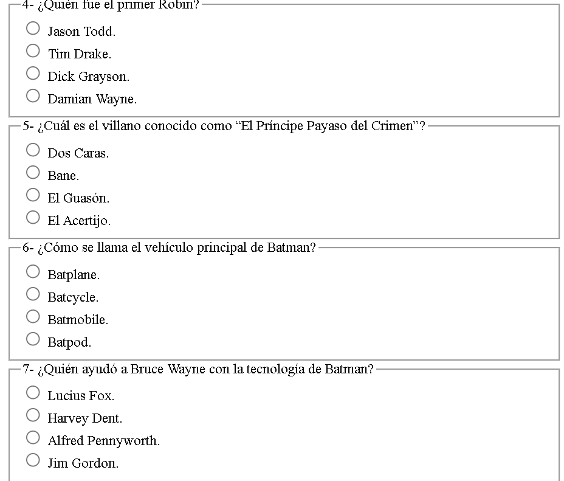
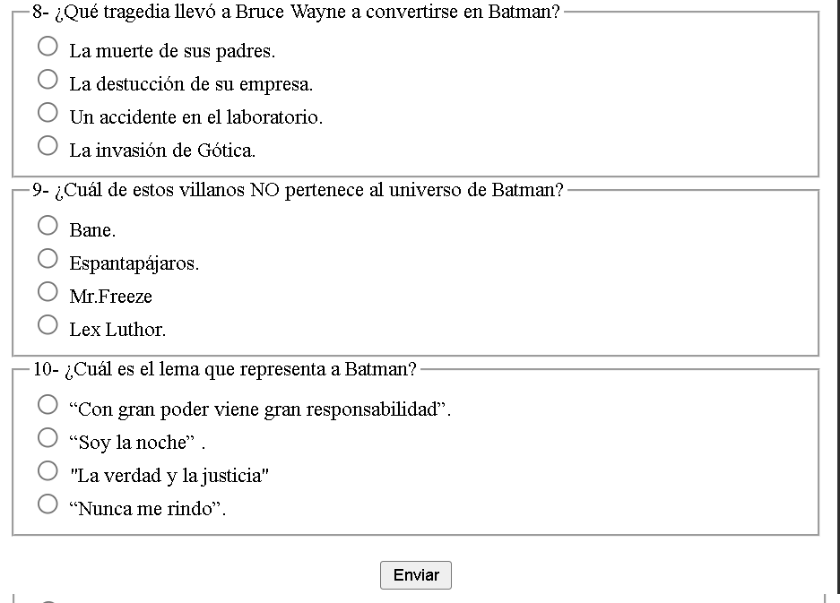
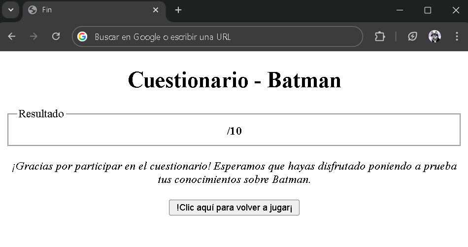

# HTML - Cuestionario personalizado.

En esta actividad, los alumnos deberán elaborar un cuestionario de diez preguntas sobre un tema de libre elección. Este cuestionario deberá incluir un documento `HTML` de bienvenida, que contenga un botón para acceder al cuestionario. En dicho cuestionario, se deberá solicitar al usuario que ingrese su nombre y responda todas las preguntas. Al finalizar, tendrá que haber un botón con la opción **Enviar**, que redirija al usuario a otro documento `HTML`, el cual mostrará un título y contará con una sección destinada, en el futuro, a mostrar el resultado de las respuestas.

**Imagenes ilustrativas** :
- Imagen inicio.

- Imagenes Cuestionario.

- Fin

## Video ilustrativo:

<video src="Videos/video1.mp4" controls=""></video>
